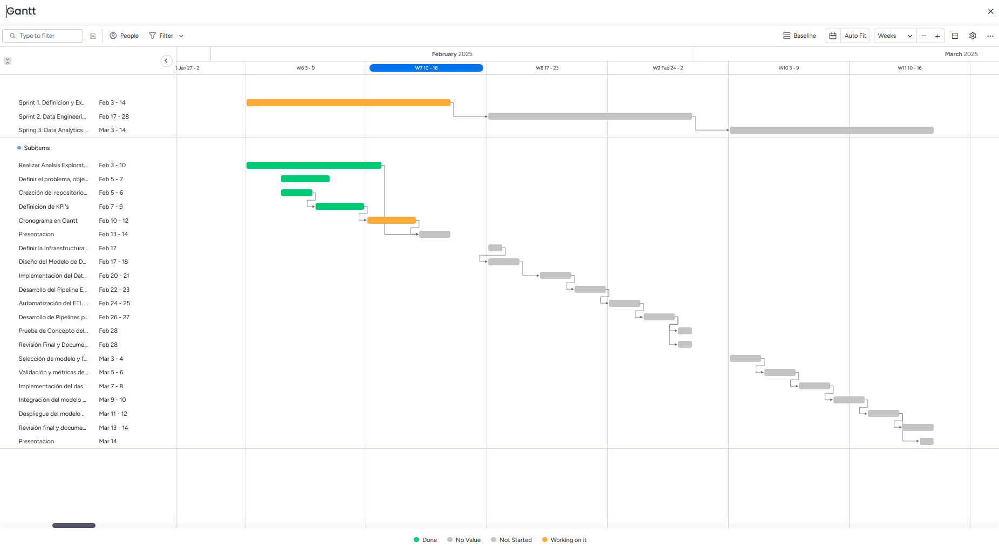

  

# Consultora Pro-Data

## 📋 Índice

- [Integrantes](#integrantes)
- [Entendimiento de la Situación Actual](#entendimiento-de-la-situacion-actual)
- [Objetivo General](#objetivo-general)
- [Objetivos Específicos](#objetivos-especificos)
- [Alcance del Proyecto](#alcance-del-proyecto)
- [KPIs](#kpis)
- [Metodología de Trabajo](#metodologia-de-trabajo)

## **Integrantes**

- [Argenis Alexis Bolivar ](https://github.com/Argeboliv05) - *Proyect Manager*
- [Ezequiel Lizio](https://github.com/Ezecordoba) - *ML Engineer*
- [Paula Irazoqui](https://github.com/paulairazoqui) - *Data Engineer*
- [Joaquín Rubiolo](https://github.com/joarubiolo) - *DevOps*
- [Sebastian Prats](https://github.com/sebaprats) - *Data Analyst*

## **Entendimiento de la Situación Actual**

📍 **Contexto:** El sector gastronómico en Florida es altamente competitivo y diverso, con una gran cantidad de negocios en constante apertura y cierre. Sin embargo, no siempre existe una distribución equitativa de los diferentes tipos de restaurantes en cada zona, lo que puede generar oportunidades de mercado sin explotar.

📉 **Problema:** La calidad de los negocios existentes varía significativamente, con algunos establecimientos acumulando malas calificaciones y reviews negativas. Esto representa una oportunidad para nuevos emprendedores que deseen establecer negocios con mejores estándares de servicio y calidad.

💡 **Solución:** Mediante el análisis de datos y técnicas de machine learning, es posible identificar áreas con deficiencia en oferta gastronómica y baja calidad de servicio, proporcionando recomendaciones estratégicas para maximizar el éxito de nuevos negocios.

## **Objetivo General**

Desarrollar un sistema de recomendación que, basado en datos de negocios gastronómicos en el estado de  Florida - EEUU, sugiera la mejor ubicación para abrir un nuevo establecimiento.

## **Objetivos Específicos**

1️⃣ Analizar la distribución geográfica de los negocios gastronómicos en Florida para identificar zonas con baja oferta.` `
2️⃣ Evaluar la calidad de los negocios existentes mediante análisis de reviews y ratings.` `
3️⃣ Determinar características clave de los negocios exitosos.` `
4️⃣ Desarrollar un modelo de recomendación basado en carencias del mercado y calidad de la competencia.` `
5️⃣ Validar la efectividad del sistema con datos históricos.` `

## **Alcance del Proyecto**

### **¿Qué vamos a hacer?**

📢 Desarrollar un modelo de Machine Learning que prediga si un negocio tendrá éxito. La recomendación se basará en la carencia de cierto tipo de negocio en una zona y la baja calidad de los existentes según reviews. Además, se proporcionarán características clave de los negocios exitosos.

🔹 **Esto incluye:**

✅ Un **EDA (Exploratory Data Analysis)** completo para entender los datos.` `
✅ Implementación de un  **Data Warehouse** para almacenar y gestionar la base de datos de manera eficiente.` `
✅ Creación de **features clave** que impactan el éxito de un negocio.` `
✅ Entrenamiento de un **modelo de clasificación** para predecir éxito o fracaso.` `
✅ Implementación de un **dashboard interactivo** para visualizar los resultados.` `
✅ **Despliegue del modelo en la nube** para uso en tiempo real.` `

### **🏆 Base de Recomendación**

📢 **Nuestro sistema recomendará ubicaciones para nuevos negocios basándose en los siguientes criterios:**

✅ Se ubica en una **zona con baja oferta gastronómica** o con **competencia de baja calidad** según calificaciones y reviews.` `
✅ Se alinea con las **características clave de los negocios exitosos**, identificadas en el análisis de datos.` `
✅ Se encuentra en un área con **potencial de demanda insatisfecha**, determinada por la evaluación de check-ins y reviews.` `

### **🌍 Alcance Geográfico**

📢 **Limitamos el análisis a negocios en el Estado Florida de EE.UU.**` `
🔹 Esto permite trabajar con un dataset más limpio y evitar sesgos por diferencias culturales en reseñas.` `

### **🕒 Limitación en el Tiempo**

📢 **Nuestro modelo solo se entrenará con datos de los últimos 5 años (2017-2022).**` `
🔹 Evita incluir negocios antiguos cuyo comportamiento puede no ser representativo.` `
🔹 Nos aseguramos de que los datos sean recientes y relevantes.` `

### 🛠️ **Stack Tecnologico**

📢 **Usaremos herramientas estándar para garantizar reproducibilidad:**

✅ **Almacenamiento de Datos**

🔹 Local (CSV, Parquet)` `
  **Ventajas:**` `
  ✔️ Fácil de manejar y compartir.` `
  ✔️ Compatible con la mayoría de herramientas de análisis de datos.` `
  ✔️ Parquet ofrece mayor eficiencia en almacenamiento y rendimiento para grandes volúmenes de datos.` `

🔹 **Google Cloud Storage** ` `
  **Ventajas:**` `
  ✔️ Escalabilidad y alta disponibilidad.` `
  ✔️ Integración con Google BigQuery, Spark y otras herramientas.` `
  ✔️ Seguridad avanzada con control de acceso y encriptación.` `

✅ **Procesamiento y Análisis** ` `
🔹 **Python (Pandas, NumPy, Scikit-learn)**` `
  **Ventajas:**` `
  ✔️ Comunidad activa y bien documentada.` `
  ✔️ Alto rendimiento en procesamiento de datos.` `
  ✔️ Amplia compatibilidad con otros frameworks de ML y visualización.` `

🔹 **EDA y Visualización:** Seaborn, Matplotlib ` `
  **Ventajas:**` `
  ✔️ Exploración rápida de patrones en los datos.` `
  ✔️ Personalización avanzada de gráficos.` `
  ✔️ Integración con Pandas para visualización directa de DataFrames.` `

🔹 **ML Models:** Random Forest, XGBoost, Regresión Logística ` `
  **Ventajas:**` `
  ✔️ Modelos interpretables y eficientes.` `
  ✔️ Adaptabilidad a distintos tipos de datos.` `
  ✔️ XGBoost ofrece gran rendimiento en grandes volúmenes de datos.` `

✅ **Despliegue** ` `
🔹 Dashboard en **PowerBI** ` `
  **Ventajas:**` `
  ✔️ Visualizaciones dinámicas y personalizables.` `
  ✔️ Integración con diversas fuentes de datos.` `
  ✔️ Facilidad de uso para usuarios sin conocimientos técnicos avanzados.` `

🔹  API en **FastAPI** para consultas en tiempo real ` `
  **Ventajas:**` `
  ✔️ Rápido y eficiente gracias a su compatibilidad con ASGI.` `
  ✔️ Documentación automática con Swagger UI.` `
  ✔️ Fácil integración con bases de datos y modelos de machine learning.` `

## **KPIs**

### 1️⃣ **Tasa de Crecimiento de Calificaciones (Calificación promedio mensual)**

📢 **Objetivo:** Incrementar en un 0,1 % la calificación promedio del negocio por trimestre.

Este KPI medirá la evolución en la calificación promedio del negociogastronómico en el último trimestre respecto al trimestre anterior

📢 **Fórmula:**

📌 **Leyenda:**

* **TCC**: Tasa de Crecimiento de Calificaciones.` `
* **CP_T**: Calificación promedio en el último trimestre.` `
* **CP_T-1**: Calificación promedio en el trimestre anterior.` `

### 2️⃣ **Tasa de Crecimiento de Reviews**

📢 **Objetivo:** Incrementar la cantidad de reseñas del nuevo negocio en un 5% por trimestre

Este KPI medirá la evolución de la popularidad del nuevo negocio gastronómico respecto del trimestre anterior, entendiendo que un indicador de esa popularidad es que aumente la cantidad de reseñas.

📢 **Fórmula:**

📌 **Leyenda:**

* **TCR**: Tasa de Crecimiento de Reviews ajustada al objetivo del 5%.` `
* **R_t**: Cantidad de reseñas en el trimestre actual.` `
* **R_t-1**: Cantidad de reseñas en el trimestre anterior.` `

### 3️⃣ **Indice de repeticion de clientes**

📢 **Objetivo:** incrementar el índice de repetición de clientes en un 10 % por trimestre

Este KPI medirá la satisfacción de los clientes a partir de si regresan o no al local en el último trimestre en relación al trimestre anterior.

📢 **Fórmula:**

📌 **Leyenda:**

* **ICR**: Índice de Repetición de Clientes ajustado al objetivo del 10%.` `
* **C_r**: Número de clientes que repiten en el trimestre actual.` `
* **C_t**: Número total de clientes en el trimestre actual.` `

## **Metodología de Trabajo**

📢 Para garantizar una gestión eficiente del proyecto, se aplicará la metodología **Scrum**, organizando el trabajo en sprints con entregables claros.

### **👥 Roles del Equipo**

✅ **Proyect Manager:** Argenis Bolivar ` `
✅ **Data Engineer:** Paula Irazoqui ` `
✅ **Data Analyst:** Sebastián Prat ` `
✅ **ML Engineer:** Ezequiel Lizio ` `
✅ **DevOps:** Joaquin Rubiolo ` `

### **📌 Roles en cada Sprint**

Para distribuir responsabilidades, los roles clave en cada sprint son:

| **Sprint**   | **Product Owner**                                 | **Scrum Master**                                | **Data Engineer**           | **Data Analyst**             | **ML Engineer**                        | **DevOps**                               |
| ------------------ | ------------------------------------------------------- | ----------------------------------------------------- | --------------------------------- | ---------------------------------- | -------------------------------------------- | ---------------------------------------------- |
| **Sprint 1** | Definir objetivos y alcance                        | Gestionar backlog y  reuniones              | Extraer y limpiar datos      | Explorar datos y definir KPIs | Extraer y limpiar datos                 | Configurar repositorio Git                |
| **Sprint 2** | Priorizar implementación  del ETL            | Asegurar que los  procesos se  cumplan | Implementar y validar el ETL | Analizar calidad de datos     | MVP Proof of Concept  de producto de ML | Configurar infraestructura  de datos |
| **Sprint 3** | Priorizar desarrollo  del modelo  y dashboard | Coordinar la entrega final                       | Optimizar datos para ML      | Visualizar KPIs y resultados  | Entrenar modelo de ML                   | Desplegar API y dashboard                 |

#### **1️⃣ Épicas Principales**

1. **Definición del Proyecto y Exploración de Datos** ` `
2. **Implementación del Pipeline ETL y Almacenamiento** ` `
3. **Desarrollo del Modelo de Machine Learning** ` `
4. **Implementación del Dashboard Interactivo** ` `
5. **Optimización y Validación del Sistema** ` `

#### **2️⃣ Historias de Usuario por Sprint**

##### **📌 Sprint 1: Definición y Exploración de Datos (03 Feb - 14 Feb)**

**HU1:** *Como analista de datos, quiero realizar un análisis exploratorio (EDA) para entender la calidad y características de los datos disponibles.*

* **Tareas:**
  ✅ Recopilar datasets de negocios gastronómicos y reviews.
  ✅ Identificar valores nulos, duplicados y outliers.
  ✅ Generar reportes visuales sobre la distribución de datos.

**HU2:** *Como equipo de desarrollo, quiero definir los KPIs para medir el éxito del sistema.*

* **Tareas:**
  ✅ Identificar métricas clave para evaluar recomendaciones del modelo.
  ✅ Documentar fórmulas y criterios de medición.

**HU3:** *Como desarrollador, quiero establecer un repositorio en GitHub para el control de versiones.*

* **Tareas:**
  ✅ Crear la estructura del repositorio.
  ✅ Configurar branches y flujos de trabajo Git.
  ✅ Documentar estándares de codificación y colaboración.

##### **📌 Sprint 2: Data Engineering (17 Feb - 28 Feb)**

**HU4:** *Como ingeniero de datos, quiero implementar un pipeline ETL automatizado para garantizar la limpieza y transformación de los datos.*

* **Tareas:**
  ✅ Diseñar el flujo de extracción, transformación y carga (ETL).` `
  ✅ Configurar un Data Warehouse / Data Lake.` `
  ✅ Implementar una carga incremental para nuevos datos.` `

**HU5:** *Como arquitecto de datos, quiero diseñar un modelo relacional para almacenar la información de manera eficiente.*

* **Tareas:**
  ✅ Crear un modelo de base de datos (ERD).` `
  ✅ Implementar PostgreSQL o BigQuery para almacenamiento.` `
  ✅ Validar la integridad de los datos mediante consultas SQL.` `

**HU6:** *Como ingeniero de datos, quiero realizar pruebas de calidad para asegurar que los datos son confiables.*

* **Tareas:**
  ✅ Implementar validaciones de datos en Airflow o Prefect.` `
  ✅ Generar reportes de calidad de datos.` `
  ✅ Resolver problemas de datos faltantes o inconsistentes.` `

##### **📌 Sprint 3: Data Analytics + ML (3 Mar - 15 Mar)**

**HU7:** *Como analista de datos, quiero visualizar las recomendaciones del modelo en un dashboard interactivo.*

* **Tareas:**
  ✅ Implementar gráficos de visualización de KPIs.` `
  ✅ Integrar el dashboard con la base de datos.` `
  ✅ Generar filtros interactivos para el análisis de datos.` `

**HU8:** *Como desarrollador de machine learning, quiero entrenar un modelo de recomendación basado en datos históricos.*

* **Tareas:**
  ✅ Seleccionar el algoritmo de ML más adecuado (clustering, regresión, etc.).` `
  ✅ Optimizar el modelo con hiperparámetros.` `
  ✅ Evaluar su rendimiento con métricas de precisión y recall.` `

**HU9:** *Como DevOps, quiero desplegar el modelo en producción para que pueda ser utilizado en tiempo real.*

* **Tareas:**
  ✅ Crear API con **FastAPI** para consumir el modelo.` `
  ✅ Integrar el modelo con el dashboard para visualización en tiempo real.` `
  ✅ Probar la API con datos de prueba y optimizar tiempos de respuesta.` `

---

#### **3️⃣ Backlog Técnico (Tareas Prioritarias)**

✅ **Sprint 1: Definición y Exploración de Datos** ` `

* Configurar repositorio en **GitHub** con estructura de carpetas.` `
* Realizar EDA.` `
* Documentar las fuentes de datos y su confiabilidad.` `

🏆 **Hitos:**

* Documentación del EDA y calidad de datos.` `
* Definición de KPIs.` `
* Creación del repositorio en GitHub.` `

✅ **Sprint 2: Data Engineering**

* Configurar **Airflow** o **Prefect** para orquestación del ETL.` `
* Implementar almacenamiento en  **Google BigQuery**.` `
* Generar logs de procesamiento y validación de datos.` `

🏆 **Hitos:**

* Implementación del Data Lake y Data Warehouse.` `
* Pipeline ETL en funcionamiento.` `
* Validación de datos y reportes de calidad.` `

✅ **Sprint 3: Data Analytics + ML**

* Conectar el dashboard con la base de datos.` `
* Entrenar y desplegar el modelo de Machine Learning.` `
* Evaluar el sistema con datos en tiempo real.` `

🏆 **Hitos:**

* Dashboard funcional con visualización de KPIs.` `
* Modelo de ML entrenado y optimizado.` `
* Despliegue del modelo en la nube.` `

#### 4️⃣ Diagrama de Gantt

---

## **Pipeline ETL**

El proceso de **Extracción, Transformación y Carga (ETL)** se llevó a cabo para garantizar que los datos utilizados en el análisis y modelado sean limpios, estructurados y almacenados de manera eficiente.

### **1️⃣ Extracción de Datos**

Los datos utilizados en este proyecto provienen de diversas fuentes, incluyendo plataformas de reseñas gastronómicas como **Google Maps** y **Yelp**, además de información demográfica extraída mediante **web scraping** de fuentes públicas.

### **2️⃣ Transformación de Datos**

Para asegurar la calidad de los datos y facilitar su análisis, se llevaron a cabo los siguientes procesos de transformación:

✅ **Limpieza de Datos**

- Se verificó la presencia de valores nulos y duplicados en las columnas clave.
- No se detectaron problemas significativos en este aspecto.

✅ **Generación de Features**

- Se realizó un **análisis de sentimiento** sobre los comentarios de los usuarios para capturar la percepción del público respecto a cada establecimiento.
- Se realizó un **desglose de atributos y categorías**, separando información relevante en columnas independientes para facilitar su análisis.

✅ **Modelo de Datos**

- Se diseñó un **modelo en estrella**, con una tabla central que contiene la información de los negocios y tablas auxiliares que almacenan detalles específicos.
- La estructura del modelo de datos está documentada en el repositorio dentro de la carpeta **documentación**.

### **3️⃣ Carga de Datos**

Los datos procesados fueron almacenados en **buckets de Google Cloud** y también se encuentran disponibles en el repositorio del proyecto para su consulta y análisis.

---

### **4️⃣ Orquestación y Automatización**

La orquestación del proceso ETL se realiza mediante una  **función en Cloud Run** , que es activada automáticamente por un **trigger** cuando un nuevo archivo JSON es detectado en el bucket `rawdata_1` de  **Cloud Storage** .

#### 📌 Flujo del Proceso:

1️⃣ **Detección de eventos en GCS**

* Un archivo JSON es cargado en el bucket `rawdata_1`.
* Se activa la función en Cloud Run mediante un evento de actualización.

2️⃣ **Ejecución de la función en Cloud Run**

* La función obtiene el archivo desde Cloud Storage.
* Se verifica si el archivo ya ha sido procesado utilizando Firestore.
* Se transforma y normaliza la data.

3️⃣ **Almacenamiento en GCS**

* Los datos transformados son guardados en formato CSV en otro bucket de Cloud Storage (`procdata_1`).

4️⃣ **Carga en BigQuery**

* Los datos procesados se insertan en la tabla **metadatos** de BigQuery.
* Se aplica carga incremental para evitar duplicaciones.
* Se registra la transacción en Firestore.

---

### **5️⃣ Carga Incremental**

Para optimizar la inserción de datos en BigQuery y evitar duplicaciones, se implementa un proceso de  **carga incremental** .

#### 🔹 Proceso de Carga Incremental:

1️⃣ **Verificación de datos en Firestore**

* Se consulta Firestore para determinar si un archivo ya ha sido procesado.
* Si el evento ya existe, se omite la carga para evitar duplicaciones.

2️⃣ **Transformación y Almacenamiento en Cloud Storage**

* Se convierte el JSON en un formato estructurado.
* Se guarda un archivo **CSV** en el bucket `procdata_1` para su posterior carga.

3️⃣ **Carga de datos en BigQuery**

* Se inserta la nueva información en la tabla  **metadatos** .
* Se utiliza `WRITE_APPEND` para agregar solo los nuevos registros sin sobrescribir los existentes.

4️⃣ **Registro del evento en Firestore**

* Se almacena en Firestore el `event_id` del archivo para evitar que se vuelva a procesar en el futuro.

---

### **6️⃣ Desafíos y Optimización**

Algunos de los principales desafíos y optimizaciones implementadas fueron:

✅ Manejo y limpieza de datos de múltiples fuentes.
✅ Implementación del modelo de datos en estrella para estructurar la información de forma eficiente.
✅ Desglose de atributos y categorías para mejorar la organización y análisis de los datos.

---

## **Modelos de Machine Learning**

### **Modelo 1**

Sistema de recomendación con que tiene como input una categoría de restaurantes y devuelve las tres mejores ciudades en las que se recomienda poner uno nuevo (mostrándolas en un mapa) y los 10 atributos que debería presentar para tener éxito dentro de esta categoría. Para mas información de como esta armado ir a ...

https://github.com/joarubiolo/Pro-data-consultora/blob/main/Modelo_ML/info.md

### **Modelo 2**

Este proyecto implementa un sistema de recomendación de negocios basado en Machine Learning utilizando Streamlit como interfaz de usuario. El modelo de aprendizaje automático analiza datos de diferentes ciudades y categorías de negocios, evaluando factores como competencia y puntuaciones de reseñas para sugerir las mejores opciones de negocio. Para mas informacion, debajo esta el link a la documentacion

https://github.com/joarubiolo/Pro-data-consultora/blob/main/Modelo_ML2/info.md
